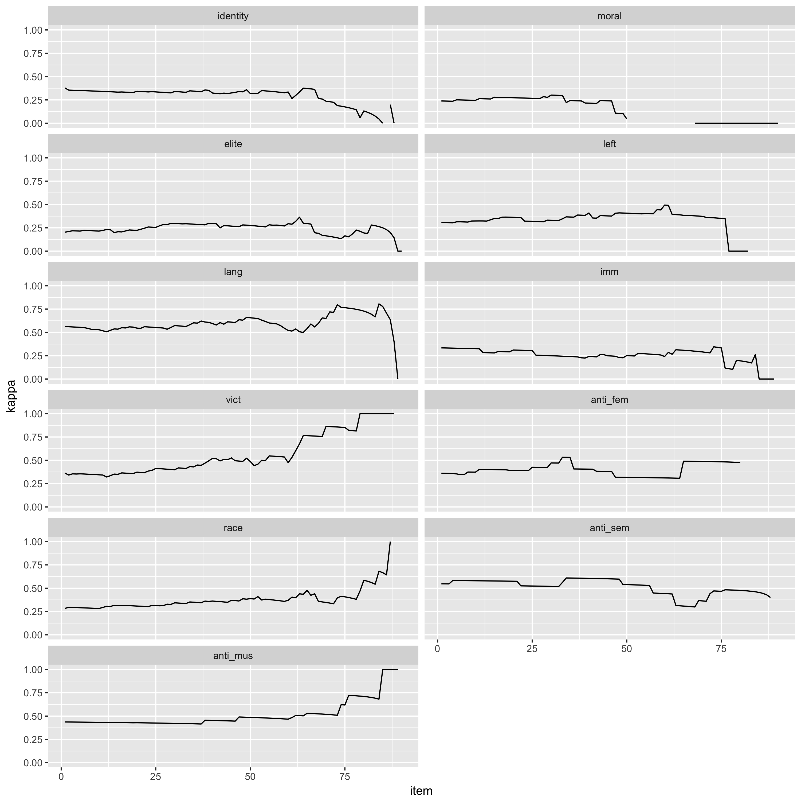

## packages

```{r}
pacman::p_load(dplyr, ggplot2, googlesheets, openxlsx, stringr, rvest, dplyr, ggplot2)
```


## google auth

```{r}
#gs_auth()
googlesheets::gs_auth(token = "shiny_app_token.rds")
```


```{r}
with_label_id <- gs_title("altright_data_final")
alright_label <- gs_read(with_label_id)
```


```{r}
clean_slider <- function(x){
  x %>%
    str_replace_all("Not Present", "1") %>%
    str_replace_all("Strongly Present", "5") %>%
    str_replace_all("99", "0")
}

df_coder <- alright_label %>%
  mutate(coder_id = paste0(id_label, "_", coder)) %>%
  filter(!duplicated(coder_id)) %>%
  filter(duplicated(id_label)) %>%
  arrange(id) %>%
  purrr::map_df(clean_slider) %>%
  mutate_at(vars(identity:anti_mus), as.numeric)

glimpse(df_coder)
```

```{r}
library(irr)
# data(diagnoses)
# dat <- diagnoses[,1:3]

df_coder_wide <- df_coder %>%
  select(race, coder, id_label) %>%
  filter(coder %in% c("Tobit", "startimeash")) %>%
  mutate(race = ifelse(as.numeric(race) > 1, 1, 0)) %>%
  tidyr::spread("coder", "race") %>%
  select(-id_label) %>%
  na.omit()

kappam.fleiss(df_coder_wide)
kappa2(df_coder_wide[2:90, ])
```


```{r}
kappas <- c()
for (jj in 1:nrow(df_coder_wide)) {
  kappas[jj] <- kappa2(df_coder_wide[jj:90, ])$value
}

data.frame(kappa = kappas, item = 1:length(kappas)) %>%
  ggplot(aes(item, kappa)) +
  geom_line()
```


```{r}
get_kappa <- function(data, var = "race", coders = c("Tobit", "startimeash")){
  
  target_index <- match(var, names(data))
  
  wide <- data %>%
    select(target_index, coder, id_label) %>%
    rename_(target = var) %>%
    filter(coder %in% coders) %>%
    #mutate(target = ifelse(target > 1, 1, 0)) %>%
    tidyr::spread("coder", "target") %>%
    select(-id_label, -target) %>%
    na.omit()
  
  kappas <- c()
  for (jj in 1:nrow(wide)) {
    kappas[jj] <- kappa2(wide[jj:90, ])$value
  }

  return(data.frame(kappa = kappas, item = 1:length(kappas), var = var))
}
```


```{r}
get_kappa(df_coder) %>%
  ggplot(aes(item, kappa)) +
  geom_line()
```


```{r}
get_kappa(df_coder, var = "identity") %>%
  ggplot(aes(item, kappa)) +
  geom_line() +
  ylim(0, 1)
```


```{r}
get_kappa2 <- function(x) get_kappa(df_coder, var = x)

plot_data <- df_coder %>%
  select(identity:anti_mus, -irony) %>%
  colnames %>%
  purrr::map(get_kappa2) %>%
  purrr::reduce(rbind) 

gg_kappa <- plot_data %>%
  ggplot(aes(item, kappa)) +
    geom_line() +
    ylim(0, 1) + 
    facet_wrap(~var, ncol = 2)

ggsave(gg_kappa, file = "gg_kappa.png", width = 10, height = 10)
```





```{r}
df_coder %>%
  select(race, coder) %>%
  group_by(coder) %>%
  mutate(id = 1:n()) %>%
  ungroup %>%
  group_by(id) %>%
  filter(coder %in% c("Tobit", "startimeash")) %>%
  summarize(sdv = sd(race), min = min(race), max = max(race)) %>%
  mutate(dev = max - min) %>%
  ggplot(aes(id, sdv)) +
    geom_bar(stat = "identity")
```


```{r}
get_diff <- function(data, var = "race", coders = c("Tobit", "startimeash")){
  
  test <- min(data[[var]]) > 0
  
  target_index <- match(var, names(data))

  data1 <- data %>%
    select(target_index, coder) %>%
    rename_(target = var)
    
  if(test){
    data1 <- data1 %>%
      mutate(target = target - 1)
  }

  data2 <- data1 %>%
    group_by(coder) %>%
    mutate(id = 1:n()) %>%
    ungroup %>%
    group_by(id) %>%
    #filter(coder %in% coders) %>%
    summarize(sdv = sd(target), mea = mean(target)) %>%
    mutate(var = var)
  
  return(data2)
}

get_diff2 <- function(x) get_diff(df_coder, var = x)

plot_data1 <- df_coder %>%
  select(identity:anti_mus, -irony) %>%
  colnames %>%
  purrr::map(get_diff2) %>%
  purrr::reduce(rbind) 

gg_sdv <- plot_data1 %>%
  mutate(col = ifelse(sdv < 1.5, "red", "green")) %>%
  ggplot(aes(id, mea)) +
    #geom_bar(stat = "identity") +
    geom_errorbar(
      aes(ymin=mea-sdv, ymax=mea+sdv), colour="gray", width=.1) +
    #geom_line() +
    geom_point(size=1.5, aes(colour = col)) + 
    facet_wrap(~var, ncol = 1)

ggsave(gg_sdv, file = "gg_sdv.png", width = 8, height = 15)
```


